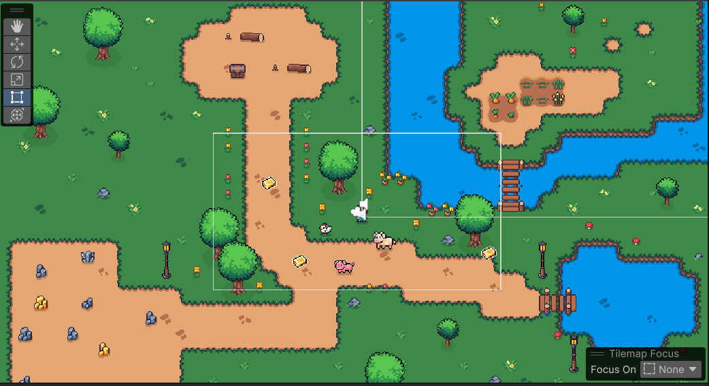
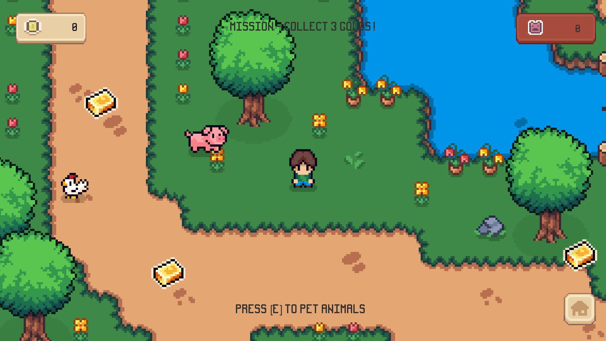
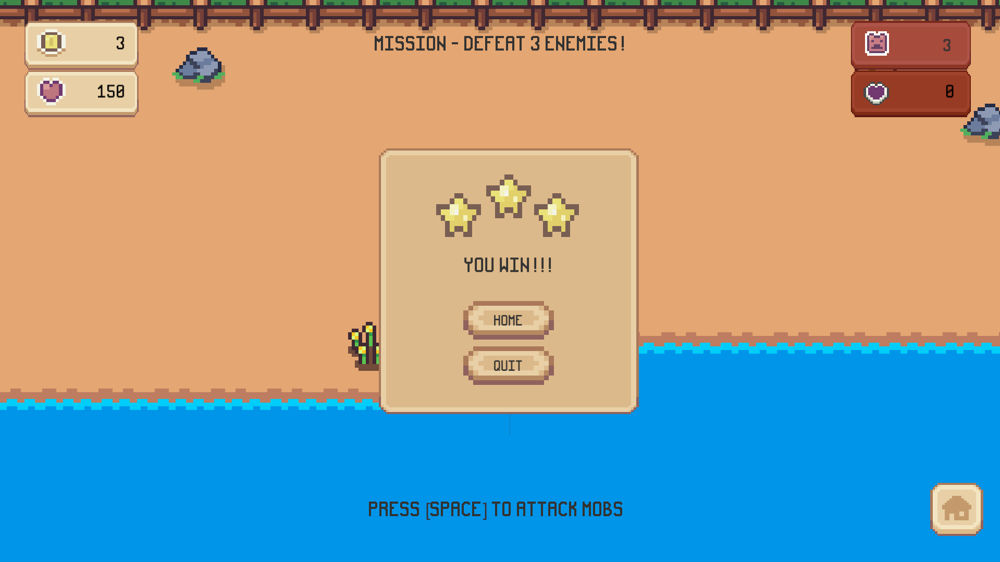
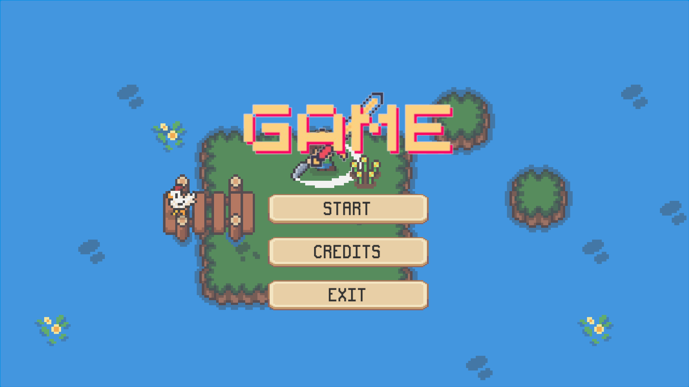

# Finals - Game Programming LC01

## Garden Scene
This is the first level of our game after player clicked on the start button in main scene. We have a main camera which follows the player.
The target is to collect 3 golds. Player can save their gold data and load it again.
Below is the unity level design and he screenshot of the game's build.

## Beach Scene
This is the level 2 - Beach. The main goal is to defeat 3 enemies and then players can win the game.
Every time an enemy is defeated, it will increment the eneies defeated count and display it on the UI panel on the top right corner. There's also player's health info and currentMob's health info.

## Main Menu

## Assets Credits
UI: https://cupnooble.itch.io/
Game Assets: https://kenmi-art.itch.io/
